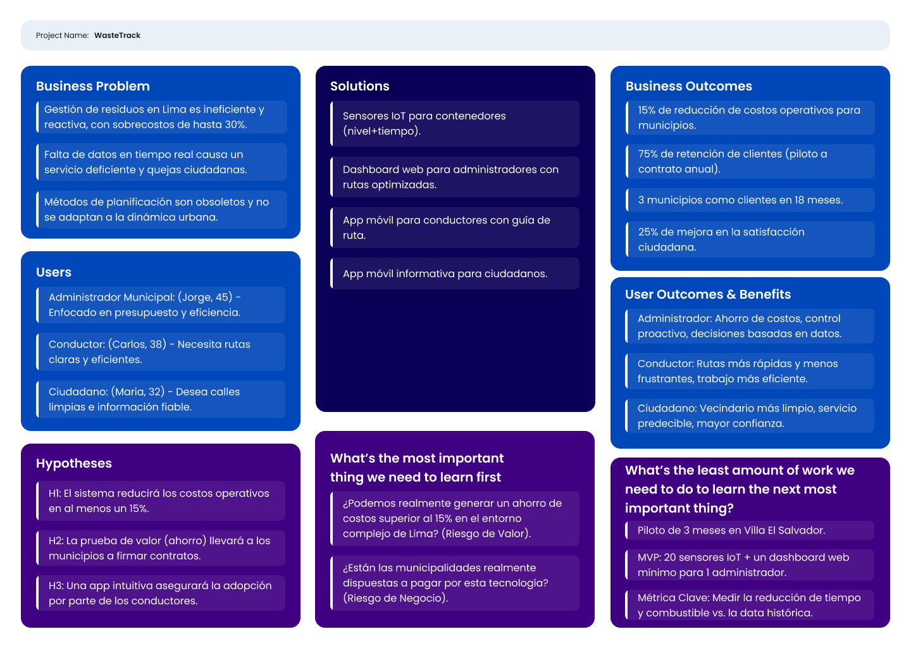
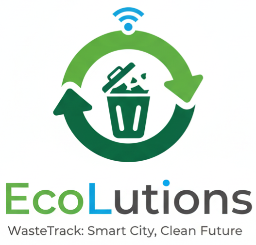

<body>
    

        
Universidad Peruana de Ciencias Aplicadas - Ingeniería de Software - 7 Ciclo

        
        
1ASI0572 - Desarrollo de Soluciones IOT

        
Sección - 3414

        
Docente: Ing. Marco Antonio Leon Baca
   
        
Informe de Trabajo Final

        
Startup: EcoLutions

        
Producto: WasteTrack

    

    

        <h3 style="font-weight: bolder">Integrantes del equipo:</h3>
        <table style="width: fit-content">
            <tr>
                <th style="text-align:start;">Estudiante</th>
                <th style="text-align:center;">Código</th>
            </tr>
            <tr>
                <td style="text-align:start;">Gutiérrez Soto, Jhosepmyr Orlando</td>
                <td>202317638</td>
            </tr>
            <tr>
                <td style="text-align:start;">Hernández Tuiro, Eric Ernesto</td>
                <td>20221C857</td>
            </tr>
            <tr>
                <td style="text-align:start;">Rivadeneyra Ramos, Joaquin David</td>
                <td>202211846</td>
            </tr>
            <tr>
                <td style="text-align:start;">Riva Rodríguez, Elmer Augusto</td>
                <td>202220829</td>
            <tr>
              <td style="text-align:start;">Rojas Ccama, Carlos Andrés</td>
              <td>202114657</td>
            </tr>
        </table>
    

    
Septiembre 2025

</body>

# Registro de Versiones del Informe

| Versión | Fecha      | Autor                             | Descripción de modificación |
|---------|------------|-----------------------------------|-----------------------------|

# Project Report Collaboration Insights

En esta sección se documenta la colaboración del equipo en la elaboración del informe, mostrando evidencias gráficas de la actividad en GitHub y su coherencia con el registro de versiones.

* URL del repositorio del Project Report en la organización de GitHub del equipo:
* [https://github.com/EcoLutions/Report-Desarrollo-de-Soluciones-IoT](https://github.com/EcoLutions/Report-Desarrollo-de-Soluciones-IoT)

# Contenido

<!-- TOC -->
* [Registro de Versiones del Informe](#registro-de-versiones-del-informe)
* [Project Report Collaboration Insights](#project-report-collaboration-insights)
* [Contenido](#contenido)
* [Student Outcome](#student-outcome)
* [Capítulo I: Introducción](#capítulo-i-introducción)
  * [1.1. Startup Profile](#11-startup-profile)
    * [1.1.1. Descripción de la Startup](#111-descripción-de-la-startup)
    * [1.1.2. Perfiles de integrantes del equipo](#112-perfiles-de-integrantes-del-equipo)
  * [1.2. Solution Profile](#12-solution-profile)
    * [1.2.1. Antecedentes y problemática](#121-antecedentes-y-problemática)
    * [1.2.2. Lean UX Process](#122-lean-ux-process)
      * [1.2.2.1. Lean UX Problem Statements](#1221-lean-ux-problem-statements)
      * [1.2.2.2. Lean UX Assumptions](#1222-lean-ux-assumptions)
      * [1.2.2.3. Lean UX Hypothesis Statements](#1223-lean-ux-hypothesis-statements)
      * [1.2.2.4. Lean UX Canvas](#1224-lean-ux-canvas)
  * [1.3. Segmentos objetivos](#13-segmentos-objetivos)
* [Capítulo II: Requirements Elicitation & Analysis](#capítulo-ii-requirements-elicitation--analysis)
  * [2.1. Competidores](#21-competidores)
    * [2.1.1. Análisis competitivo](#211-análisis-competitivo)
    * [2.1.2. Estrategias y tácticas frente a competidores](#212-estrategias-y-tácticas-frente-a-competidores)
  * [2.2. Entrevistas](#22-entrevistas)
    * [2.2.1. Diseño de entrevistas](#221-diseño-de-entrevistas)
    * [2.2.2. Registro de entrevistas](#222-registro-de-entrevistas)
    * [2.2.3. Análisis de entrevistas](#223-análisis-de-entrevistas)
  * [2.3. Need finding](#23-need-finding)
    * [2.3.1. User personas](#231-user-personas)
    * [2.3.2. User Task Matrix](#232-user-task-matrix)
    * [2.3.3. User Journey Mapping](#233-user-journey-mapping)
    * [2.3.4. Empathy Mapping](#234-empathy-mapping)
  * [2.4. Big Picture EventStorming](#24-big-picture-eventstorming)
    * [2.4.1. Introduction and Methodology](#241-introduction-and-methodology)
    * [2.4.2. Session Process](#242-session-process)
    * [2.4.3. Resultados Obtenidos](#243-resultados-obtenidos)
    * [2.4.4. Results Obtained](#244-results-obtained)
  * [2.5. Ubiquitous Language](#25-ubiquitous-language)
* [Capítulo III: Requirements Specification](#capítulo-iii-requirements-specification)
  * [3.1. User Stories](#31-user-stories)
  * [3.2. Impact Mapping](#32-impact-mapping)
  * [3.3. Product Backlog](#33-product-backlog)
* [Capítulo IV: Solution Software Design](#capítulo-iv-solution-software-design)
  * [4.1. Strategic-Level Domain-Driven Design](#41-strategic-level-domain-driven-design)
    * [4.1.1. Design-Level EventStorming](#411-design-level-eventstorming)
      * [4.1.1.1. Candidate Context Discovery](#4111-candidate-context-discovery)
      * [4.1.1.2. Domain Message Flows Modeling](#4112-domain-message-flows-modeling)
      * [4.1.1.3. Bounded Context Canvases](#4113-bounded-context-canvases)
    * [4.1.2. Context Mapping](#412-context-mapping)
    * [4.1.3. Software Architecture](#413-software-architecture)
      * [4.1.3.1. Software Architecture System Landscape Diagram](#4131-software-architecture-system-landscape-diagram)
      * [4.1.3.2. Software Architecture Context Level Diagrams](#4132-software-architecture-context-level-diagrams)
      * [4.1.3.3. Software Architecture Container Level Diagrams](#4133-software-architecture-container-level-diagrams)
      * [4.1.3.4. Software Architecture Deployment Diagrams](#4134-software-architecture-deployment-diagrams)
  * [4.2. Tactical-Level Domain-Driven Design](#42-tactical-level-domain-driven-design)
    * [4.2.1. Bounded Context: <Bounded Context Name>](#421-bounded-context-bounded-context-name)
      * [4.2.1.1. Domain Layer](#4211-domain-layer)
      * [4.2.1.2. Interface Layer](#4212-interface-layer)
      * [4.2.1.3. Application Layer](#4213-application-layer)
      * [4.2.1.4. Infrastructure Layer](#4214-infrastructure-layer)
      * [4.2.1.5. Bounded Context Software Architecture Component Level Diagrams](#4215-bounded-context-software-architecture-component-level-diagrams)
      * [4.2.1.6. Bounded Context Software Architecture Code Level Diagrams](#4216-bounded-context-software-architecture-code-level-diagrams)
        * [4.2.1.6.1. Bounded Context Domain Layer Class Diagrams](#42161-bounded-context-domain-layer-class-diagrams)
        * [4.2.1.6.2. Bounded Context Database Design Diagram](#42162-bounded-context-database-design-diagram)
    * [4.2.2. Bounded Context: <Bounded Context Name>](#422-bounded-context-bounded-context-name)
      * [4.2.2.1. Domain Layer](#4221-domain-layer)
      * [4.2.2.2. Interface Layer](#4222-interface-layer)
      * [4.2.2.3. Application Layer](#4223-application-layer)
      * [4.2.2.4. Infrastructure Layer](#4224-infrastructure-layer)
      * [4.2.2.5. Bounded Context Software Architecture Component Level Diagrams](#4225-bounded-context-software-architecture-component-level-diagrams)
      * [4.2.2.6. Bounded Context Software Architecture Code Level Diagrams](#4226-bounded-context-software-architecture-code-level-diagrams)
        * [4.2.2.6.1. Bounded Context Domain Layer Class Diagrams](#42261-bounded-context-domain-layer-class-diagrams)
        * [4.2.2.6.2. Bounded Context Database Design Diagram](#42262-bounded-context-database-design-diagram)
* [Capítulo V: Solution UI/UX Design](#capítulo-v-solution-uiux-design)
  * [5.1. Style Guidelines](#51-style-guidelines)
    * [5.1.1. General Style Guidelines](#511-general-style-guidelines)
    * [5.1.2. Web, Mobile and IoT Style Guidelines](#512-web-mobile-and-iot-style-guidelines)
  * [5.2. Information Architecture](#52-information-architecture)
    * [5.2.1. Organization Systems](#521-organization-systems)
    * [5.2.2. Labeling Systems](#522-labeling-systems)
    * [5.2.3. SEO Tags and Meta Tags](#523-seo-tags-and-meta-tags)
    * [5.2.4. Searching Systems](#524-searching-systems)
    * [5.2.5. Navigation Systems](#525-navigation-systems)
  * [5.3. Landing Page UI Design](#53-landing-page-ui-design)
    * [5.3.1. Landing Page Wireframe](#531-landing-page-wireframe)
    * [5.3.2. Landing Page Mock-up](#532-landing-page-mock-up)
  * [5.4. Applications UX/UI Design](#54-applications-uxui-design)
    * [5.4.1. Applications Wireframes](#541-applications-wireframes)
    * [5.4.2. Applications Wire flow Diagrams](#542-applications-wire-flow-diagrams)
    * [5.4.3. Applications Mock-ups](#543-applications-mock-ups)
    * [5.4.4. Applications User Flow Diagrams](#544-applications-user-flow-diagrams)
  * [5.5. Applications Prototyping](#55-applications-prototyping)
* [Conclusiones](#conclusiones)
* [Bibliografía](#bibliografía)
* [Anexos](#anexos)
  * [Anexo A: Enlaces de Herramientas Colaborativas](#anexo-a-enlaces-de-herramientas-colaborativas)
    * [A.1 Big Picture Event Storming - Workspace Figma](#a1-big-picture-event-storming---workspace-figma)
<!-- TOC -->

# Student Outcome

El curso contribuye al cumplimiento del Student Outcome ABET:

****ABET - EAC - Student Outcome 5****

**Criterio:** La capacidad de funcionar efectivamente en un equipo cuyos miembros juntos proporcionan liderazgo, crean un entorno de colaboración e inclusivo, establecen objetivos, planifican tareas y cumplen objetivos.

En el siguiente cuadro se describe las acciones realizadas y enunciados de conclusiones por parte del grupo, que permiten sustentar el haber alcanzado el logro del ABET – EAC - Student Outcome 5.

| **Criterio específico**                                                                             | **Acciones realizadas** | **Conclusiones** |
|-----------------------------------------------------------------------------------------------------|-------------------------|------------------|  
| **Trabaja en equipo para proporcionar liderazgo en forma conjunta.**                                |                         |                  |
| **Crea un entorno colaborativo e inclusivo, establece metas, planifica tareas y cumple objetivos.** |                         |                  |

# Capítulo I: Introducción

## 1.1. Startup Profile

### 1.1.1. Descripción de la Startup

EcoLutions es una startup peruana especializada en el desarrollo de soluciones IoT inteligentes para la optimización de la gestión de residuos sólidos urbanos. Fundada en 2025, nuestro enfoque se centra en revolucionar los sistemas tradicionales de recolección de basura mediante la implementación de tecnología de sensores avanzados, análisis de datos en tiempo real y algoritmos de optimización de rutas.
Nuestra misión es transformar la gestión de residuos sólidos en las ciudades peruanas, comenzando por Lima Metropolitana, a través de soluciones tecnológicas innovadoras que reduzcan costos operativos, mejoren la eficiencia del servicio y contribuyan a ciudades más limpias y sostenibles.

**Propuesta de Valor**

* Optimización inteligente: Algoritmos que combinan nivel de llenado y tiempo de permanencia para priorizar recolecciones
* Arquitectura híbrida: Procesamiento Edge para alertas inmediatas y Cloud para análisis avanzados
* Modelo B2B sostenible: Licencia anual fija que permite presupuestación municipal predecible
* Enfoque local: Soluciones adaptadas específicamente a las necesidades y regulaciones de distritos peruanos

**Visión**

Ser la empresa líder en soluciones IoT para gestión inteligente de residuos en Latinoamérica, contribuyendo al desarrollo de ciudades más eficientes, limpias y sostenibles.
Valores

* Innovación responsable: Tecnología que genera impacto social positivo
* Sostenibilidad: Compromiso con el medio ambiente y la eficiencia de recursos
* Transparencia: Datos abiertos que generen confianza en la gestión pública
* Colaboración: Trabajo conjunto con municipalidades y ciudadanía

### 1.1.2. Perfiles de integrantes del equipo

| Foto del participante                                                                       | Nombres y apellidos              | Código de estudiante | Carrera                | Conocimientos técnicos y habilidades                                                                                                                                                                                                                                                                                                |
|---------------------------------------------------------------------------------------------|----------------------------------|----------------------|------------------------|-------------------------------------------------------------------------------------------------------------------------------------------------------------------------------------------------------------------------------------------------------------------------------------------------------------------------------------|
|          | Eric Ernesto Hernández Tuiro     | 20221C857            | Ingeniería de Software | Especialista en desarrollo backend con Java/Spring Boot y diseño de arquitecturas de sistemas. Enfocado en tecnologías empresariales y soluciones eficientes. Será responsable de los servicios web, procesamiento de datos y desarrollo de APIs para la plataforma WasteTrack.                                                     |
|          | Elmer Augusto Riva Rodríguez     | 202220829            | Ingeniería de Software | Desarrollador con experiencia en Angular/Spring Boot y Vue.js/ASP.NET, enfocado en arquitecturas monolíticas y desarrollo de aplicaciones. Liderará el desarrollo de aplicaciones móviles para conductores y ciudadanos, garantizando interfaces intuitivas y funcionales.                                                          | 
|  | Jhosepmyr Orlando Gutiérrez Soto | 202317638            | Ingeniería de Software | Especialista en desarrollo full-stack con Java/Spring Boot y frameworks frontend como Angular y Vue.js. Experiencia en microservicios y servicios cloud (AWS, Azure, GCP). Aporta habilidades de liderazgo técnico, toma de decisiones y coordinación de equipos de desarrollo para la arquitectura general del sistema WasteTrack. | 
|      | Joaquin David Rivadeneyra Ramos  | 202211846            | Ingeniería de Software | Desarrollador con dominio de múltiples tecnologías: Java, JavaScript, TypeScript, C#, Dart, y frameworks como Angular y Vue. Habilidades comunicativas y colaborativas. Se encargará de la integración entre componentes del sistema y desarrollo de funcionalidades multiplataforma.                                               |
|                                                                                             | Carlos Andres Rojas Ccama        | 202114657            |                        |                                                                                                                                                                                                                                                                                                                                     |

## 1.2. Solution Profile

### 1.2.1. Antecedentes y problemática

Esta sección presenta un análisis de la situación actual de la gestión de residuos sólidos en Lima Metropolitana. Se utiliza la técnica de las 5 W's y 2 H's para desglosar el problema, identificar a los actores involucrados, el contexto y, fundamentalmente, cuantificar su magnitud. El propósito es establecer una base fáctica sólida que justifique la necesidad y el enfoque de WasteTrack, nuestra solución tecnológica diseñada para abordar estas deficiencias.

**Análisis mediante la técnica de las 5 W's y 2 H's:**

* WHO - ¿Quién está afectado?: 
El problema impacta directamente a los habitantes de Lima Metropolitana, quienes generan más de 8,000 toneladas de residuos sólidos diariamente (Actualidad Ambiental, 2018). Involucra también a las 43 municipalidades distritales, responsables de la gestión, y a su personal operativo. De forma secundaria, afecta a recicladores y a las autoridades regulatorias como el Organismo de Evaluación y Fiscalización Ambiental (OEFA) y el Ministerio del Ambiente (MINAM).

* WHAT - ¿Cuál es el problema?:
El problema central es la gestión ineficiente y reactiva de los residuos sólidos, caracterizada por rutas de recolección no optimizadas, una cobertura deficiente del servicio que deja puntos críticos de acumulación y altos costos operativos para los municipios. Esto deriva en un serio problema de salud pública y contaminación ambiental.

* WHERE - ¿Dónde ocurre?: 
El problema se manifiesta en toda Lima Metropolitana. Las zonas más críticas se concentran en distritos con alta densidad poblacional como Villa El Salvador (368.3 ton/día), San Juan de Lurigancho (1,026.5 ton/día) y Villa María del Triunfo (357.2 ton/día) (Infobae Perú, 2024b).

* WHEN - ¿Cuándo sucede?: 
La generación de residuos es continua (24/7), con picos durante fines de semana y temporadas festivas. La recolección se realiza principalmente en horarios nocturnos para evitar el tráfico, pero la falta de planificación provoca que los problemas de acumulación sean recurrentes y visibles durante el día.

* WHY - ¿Por qué persiste?: 
La persistencia del problema se debe a una combinación de factores:
_Tecnológicos_: Ausencia de sistemas de monitoreo en tiempo real y planificación de rutas basada en métodos manuales obsoletos.
_Administrativos_: Presupuestos insuficientes, una deficiente recaudación de arbitrios que afecta la sostenibilidad financiera del servicio (PUCP, 2022) y una limitada coordinación interdistrital.
_Estructurales_: Crecimiento urbano no planificado y una cultura ciudadana con bajos índices de reciclaje, donde solo el 1% del material disponible se recicla formalmente (Actualidad Ambiental, 2018).

* HOW - ¿Cómo se manifiesta el problema?: 
El problema se evidencia a través de indicadores concretos. Lima Metropolitana genera más de 8,000 toneladas de residuos sólidos cada día (Actualidad Ambiental, 2018), y cerca del 35% de la población considera la acumulación de basura como el segundo problema ambiental que más los afecta (Infobae Perú, 2024b). Operativamente, se manifiesta en rutas de recolección redundantes y la existencia de 35 puntos críticos de acumulación tan solo en el Cercado de Lima (Infobae Perú, 2024a).

* HOW MUCH - ¿Cuál es la magnitud del impacto?: 
El impacto económico es masivo. El costo por tonelada recolectada varía entre S/120 y S/180 (PUCP, 2022). Sin optimización, se pierden recursos significativos; estudios de optimización de rutas sugieren un potencial de ahorro en costos de combustible de entre 20% y 40% (Zeo Route Planner, 2025). Adicionalmente, el 40% de los residuos de la capital terminan en botaderos informales (SNI, 2024), lo que agrava el costo ambiental y de salud pública.

**Diagrama de Ishikawa: Causas Raíz del Problema**

### 1.2.2. Lean UX Process

Esta sección aplica el Proceso Lean UX para estructurar la visión del negocio del proyecto WasteTrack. Se inicia con la formulación del problema, se desglosan las suposiciones fundamentales que sostienen el modelo de negocio y de producto, y finalmente se traducen estas suposiciones en hipótesis comprobables que guiarán el ciclo de desarrollo y validación.

#### 1.2.2.1. Lean UX Problem Statements

El estado actual de la gestión de residuos sólidos en Lima Metropolitana se basa en rutas de recolección fijas y procesos reactivos, los cuales no se adaptan a la dinámica diaria de generación de basura en una urbe de más de 10 millones de habitantes.

Lo que los métodos de gestión existentes no logran abordar es la falta de visibilidad y data en tiempo real sobre el estado de los contenedores. Esta carencia genera rutas ineficientes, desborde de basura en puntos críticos, un uso excesivo de recursos (combustible, personal, tiempo) y una creciente insatisfacción ciudadana.

Nuestro producto, WasteTrack, abordará esta brecha mediante el desarrollo de una plataforma IoT integral que monitorea el nivel de llenado y el tiempo de permanencia de los residuos en los contenedores, permitiendo a las municipalidades optimizar sus rutas de recolección de forma dinámica y proactiva.

El enfoque inicial del equipo serán las municipalidades de Lima Metropolitana, que enfrentan alta presión para mejorar la eficiencia de sus servicios públicos y reducir costos operativos, comenzando con un proyecto piloto en un distrito representativo para validar el modelo.

El equipo sabrá que ha tenido éxito cuando observe una reducción de al menos un 15% en los costos operativos de recolección, un incremento del 20% en la cobertura efectiva del servicio y una disminución del 50% en las quejas ciudadanas relacionadas con contenedores desbordados en las zonas de intervención.

#### 1.2.2.2. Lean UX Assumptions

Esta sección presenta las suposiciones fundamentales del proyecto, estructuradas en resultados de negocio, perfiles de usuario y resultados de usuario. Las suposiciones están ordenadas de manera implícita, priorizando las más críticas y riesgosas.

**Business Outcomes (Resultados de Negocio):**

Los resultados de negocio se establecen utilizando el framework AARRR (Pirate Metrics) para medir el éxito del producto y guiar las decisiones estratégicas. Se asume que se podrán alcanzar las siguientes métricas:
* Acquisition (Adquisición): El 30% de las municipalidades contactadas aceptarán una demostración del producto.
* Activation (Activación): El 50% de las municipalidades que reciban una demo firmarán un contrato para un proyecto piloto de 3 meses.
* Retention (Retención): El 75% de las municipalidades que completen el piloto se convertirán en clientes con un contrato anual.
* Revenue (Ingresos): Se logrará un Ingreso Anual por Contrato (ACV) promedio de S/ 60,000 por distrito.
* Referral (Recomendación): 1 de cada 3 municipalidades satisfechas referirá activamente la solución a otros distritos.

**Users (Usuarios):**

La identificación de usuarios se basa en el análisis del problema. Estas proto-personas representan los segmentos objetivo:

| Usuario               | Perfil                                     | Objetivos                                                                             | Obstáculos                                                                      |
|-----------------------|--------------------------------------------|---------------------------------------------------------------------------------------|---------------------------------------------------------------------------------|
| Jorge (Administrador) | 45 años, Gerente de Servicios a la Ciudad. | Reducir costos, eliminar quejas ciudadanas, modernizar la gestión.                    | Falta de datos, presión política, procesos burocráticos, resistencia al cambio. |
| Carlos (Conductor)    | 38 años, Conductor de camión recolector.   | Completar su ruta de forma eficiente, evitar sobrecargas, terminar su turno a tiempo. | Rutas ineficientes, tráfico impredecible, contenedores desbordados o vacíos.    |
| Maria (Ciudadana)     | 32 años, Vecina y madre de familia.        | Tener calles limpias, saber cuándo sacar la basura, sentirse segura en su comunidad.  | Servicio de recolección impredecible, falta de canales de información.          |

**User Outcomes (Resultados de Usuario)**

Estos son los resultados que los usuarios clave esperan lograr, categorizados en funcional, emocional y aspiracional.
* Administrador: Reducir costos y optimizar recursos (funcional), sentirse en control y proactivo (emocional), ser visto como un gestor público innovador (aspiracional).
* Conductor: Completar la ruta más rápido (funcional), sentirse menos frustrado y más eficiente (emocional), ser reconocido como un servidor público valioso (aspiracional).

#### 1.2.2.3. Lean UX Hypothesis Statements

Las hipótesis transforman las suposiciones más críticas en declaraciones testeables, priorizadas según su impacto y nivel de riesgo.

**Test (Alto valor, alto riesgo)**
* Hipótesis 1 (Riesgo de Valor):
El equipo cree que implementando sensores en 20 contenedores y un dashboard de optimización para los administradores municipales se logrará una reducción significativa de los costos operativos. Se sabrá que esto es cierto cuando, al finalizar un piloto de 3 meses, se observe una disminución medible del 15% en el tiempo y combustible utilizados para la recolección en esos puntos específicos.

* Hipótesis 2 (Riesgo de Negocio):
El equipo cree que presentando los resultados positivos del piloto a los decisores municipales se logrará demostrar un ROI claro que justifique la contratación del servicio. Se sabrá que esto es cierto cuando al menos 2 de 5 municipalidades contactadas firmen una carta de intención para un contrato anual post-piloto.

**Ship & Measure (Alto valor, bajo riesgo)**
* Hipótesis 3 (Riesgo de Adopción de Usuario):
El equipo cree que diseñando una aplicación móvil intuitiva con rutas guiadas para los conductores de recolección se logrará una alta tasa de adopción de la nueva metodología. Se sabrá que esto es cierto cuando en pruebas de usabilidad, el 90% de los conductores completen sus tareas principales sin asistencia y califiquen la herramienta con un 4/5 o superior en facilidad de uso.

* Hipótesis 4 (Riesgo de Valor para el Ciudadano):
El equipo cree que ofreciendo una aplicación móvil informativa a los ciudadanos se logrará mejorar su percepción sobre el servicio de limpieza. Se sabrá que esto es cierto cuando una encuesta post-lanzamiento muestre un aumento del 25% en el índice de satisfacción ciudadana en las zonas donde opera WasteTrack.

#### 1.2.2.4. Lean UX Canvas

El Lean UX Canvas sintetiza visualmente todos los elementos del proceso Lean UX en una sola página, facilitando la comprensión compartida del equipo y la toma de decisiones ágiles. A continuación se presenta la información condensada para cada sección del canvas:

## 1.3. Segmentos objetivos

Esta sección describe los perfiles de los tres segmentos de usuarios clave identificados en el dominio del problema de la gestión de residuos sólidos en Lima Metropolitana. La caracterización de cada segmento se respalda con datos estadísticos para contextualizar sus necesidades, desafíos y el entorno en el que operan.

**Segmento 1: Administrador de Limpieza Municipal**

**Descripción:**  
Este segmento representa al cliente principal y usuario estratégico de la plataforma WasteTrack. Son funcionarios o gestores públicos de nivel medio a alto, responsables de la planificación, ejecución y supervisión de los servicios de limpieza pública en uno de los 43 distritos de Lima.  
Su principal motivación es cumplir con los objetivos de gestión (eficiencia, cobertura, presupuesto) mientras manejan la presión política y las quejas ciudadanas. Actualmente, su toma de decisiones es mayormente reactiva debido a la falta de datos en tiempo real, lo que les genera frustración y limita su capacidad para innovar.

**Características Demográficas (Perfil Inferido):**

| Aspecto                  | Detalle                                                                |
|--------------------------|------------------------------------------------------------------------|
| Rango de Edad            | 40 - 60 años                                                           |
| Nivel Educativo          | Universitario o superior (Ingeniería, Administración Pública u afines) |
| Entorno Laboral          | Oficinas municipales, ambiente burocrático con procesos establecidos   |
| Familiaridad Tecnológica | Manejo avanzado de ofimática; limitada experiencia con analítica e IoT |

**Datos Estadísticos de Sustento:**
- El 40% de los residuos de la capital terminan en botaderos informales (SNI, 2024).
- Costo por tonelada de basura recolectada: entre S/ 120 y S/ 180 (PUCP, 2022).
- El 35% de los ciudadanos considera la acumulación de basura como el 2º problema ambiental más grave (Infobae Perú, 2024b).

---

**Segmento 2: Conductor de Recolección**

**Descripción:**  
Este segmento corresponde al usuario final operativo, pieza clave en la ejecución del servicio. Son trabajadores de primera línea que operan los vehículos recolectores y siguen las rutas diarias.  
Su principal objetivo es completar la jornada de trabajo de forma eficiente y segura. Se sienten frustrados por rutas ineficientes, tráfico de la ciudad, fallas mecánicas y contenedores desbordados o vacíos.

**Características Demográficas (Perfil Inferido):**

| Aspecto                  | Detalle                                                                                                            |
|--------------------------|--------------------------------------------------------------------------------------------------------------------|
| Rango de Edad            | 25 - 50 años                                                                                                       |
| Nivel Educativo          | Secundaria completa o educación técnica                                                                            |
| Entorno Laboral          | Trabajo de campo, operando vehículos pesados, a menudo en turnos nocturnos                                         |
| Familiaridad Tecnológica | Uso cotidiano de smartphones y apps (WhatsApp, Facebook, Waze). Capacidad de adopción de apps laborales intuitivas |

**Datos Estadísticos de Sustento:**
- Responsables de manejar más de 8,000 toneladas de residuos diarios en Lima (Actualidad Ambiental, 2018).
- Enfrentan puntos críticos de acumulación, como los 35 identificados en el Cercado de Lima (Infobae Perú, 2024a).

---

**Segmento 3: Ciudadano / Vecino Residente**

**Descripción:**  
Este segmento representa al beneficiario final del servicio y la principal fuente de validación social del proyecto.  
Abarca a toda la población residente de Lima Metropolitana, con la necesidad de vivir en un entorno limpio, seguro y saludable.  
Desean un servicio predecible y con canales de información transparentes, pero sienten desconfianza hacia la gestión municipal por la irregularidad del servicio.

**Características Demográficas (Generales de Lima):**

| Aspecto                  | Detalle                                                    |
|--------------------------|------------------------------------------------------------|
| Rango de Edad            | Todos los rangos                                           |
| Nivel Socioeconómico     | Diverso, todos los niveles de la capital                   |
| Entorno                  | Alta densidad poblacional, diversidad de contextos urbanos |
| Familiaridad Tecnológica | Alta penetración de smartphones en todos los segmentos     |

**Datos Estadísticos de Sustento:**
- Generan los miles de toneladas de residuos diarios y son los más afectados por una mala gestión (Actualidad Ambiental, 2018).
- El 35% de los ciudadanos ya considera la basura un problema prioritario en su vida diaria (Infobae Perú, 2024b).

# Capítulo II: Requirements Elicitation & Analysis

## 2.1. Competidores

En esta sección se realiza la identificación y descripción de los principales competidores en el mercado de la gestión inteligente de residuos. Dado el carácter emergente del mercado peruano, el análisis se centra en los líderes globales cuya tecnología y modelo de negocio representan el estándar de la industria y la competencia potencial en la región.

### 2.1.1. Análisis competitivo

A continuación, se presenta el "Competitive Analysis Landscape" para EcoLutions y sus tres competidores principales.

<table style="border-collapse:collapse; width:100%; text-align:left; font-size:14px; border: 1px solid #e6f0ff;">
  <tr>
    <th colspan="5" style="text-align:center;">Competitive Analysis Landscape</th>
  </tr>
  <tr>
    <td colspan="2"><strong>¿Por qué llevar a cabo este análisis?</strong></td>
    <td colspan="3">
      El objetivo de este análisis es identificar las fortalezas, debilidades y estrategias de los actores clave en el mercado global de gestión inteligente de residuos. 
      Esto permitirá a EcoLutions definir con precisión su propuesta de valor única, anticipar desafíos y diseñar una estrategia de entrada efectiva y diferenciada para el mercado peruano y latinoamericano.
    </td>
  </tr>

  <tr>
    <th></th>
    <th>EcoLutions </th>
    <th>Competidor 1: Bigbelly </th>
    <th>Competidor 2: Sensoneo </th>
    <th>Competidor 3: Ecube Labs </th>
  </tr>

  <!-- Perfil -->
  <tr>
    <td colspan="5"><strong>Perfil</strong></td>
  </tr>
  <tr>
    <td>Overview</td>
    <td>Startup peruana enfocada en una solución SaaS y hardware-agnóstico para optimizar la recolección de residuos en municipios de mercados emergentes.</td>
    <td>Líder mundial con sede en EE.UU. Famoso por sus estaciones de compactación solar que reducen la frecuencia de recolección.</td>
    <td>Empresa europea (Eslovaquia) especializada en sensores inteligentes para modernizar contenedores existentes y un potente software de análisis y optimización de rutas.</td>
    <td>Compañía surcoreana que ofrece una solución de extremo a extremo, incluyendo sensores, contenedores inteligentes y una plataforma de software en la nube.</td>
  </tr>
  <tr>
    <td>Ventaja Competitiva</td>
    <td>Hiperlocalización y flexibilidad: Modelo de negocio y soporte adaptado a la realidad económica y burocrática de los municipios peruanos. Enfoque en software y datos.</td>
    <td>Tecnología de compactación y marca: Su tecnología patentada de compactación solar es única. Tienen una fuerte presencia de marca y reputación global.</td>
    <td>Software avanzado y flexibilidad: Su plataforma de software es una de las más robustas del mercado. Su modelo permite modernizar la infraestructura existente sin reemplazarla.</td>
    <td>Solución integral (One-Stop-Shop): Ofrecen un ecosistema completo de hardware y software de un solo proveedor, simplificando la adquisición para el cliente.</td>
  </tr>
  <tr>
    <td>Valor para Clientes</td>
    <td>Reducción de costos operativos (15-25%) con una inversión inicial baja y un modelo de pago flexible (SaaS anual). Soporte local y rápido.</td>
    <td>Reducción drástica de la frecuencia de recolección (hasta 80%), eliminando desbordamientos en zonas de alto tráfico y mejorando la estética urbana.</td>
    <td>Optimización de rutas basada en datos precisos, resultando en ahorros de hasta un 30% en costos de recolección. Alta visibilidad y control sobre la operación.</td>
    <td>Una solución integrada que cubre todas las necesidades de gestión inteligente de residuos, desde el sensor hasta el análisis de datos, con un único punto de contacto.</td>
  </tr>

  <!-- Marketing -->
  <tr>
    <td colspan="5"><strong>Perfil de Marketing</strong></td>
  </tr>
  <tr>
    <td>Mercado Objetivo</td>
    <td>Municipios de Lima Metropolitana como mercado inicial, con foco en distritos con problemas de gestión críticos y presupuestos limitados.</td>
    <td>Municipios, universidades, parques temáticos y grandes corporaciones en ciudades de alto perfil que buscan soluciones de alta visibilidad y eficiencia.</td>
    <td>Municipios y empresas privadas de gestión de residuos que buscan optimizar sus operaciones existentes y tomar decisiones basadas en datos.</td>
    <td>Ciudades y empresas que buscan implementar un sistema de gestión inteligente desde cero y prefieren un único proveedor para todo.</td>
  </tr>
  <tr>
    <td>Estrategias</td>
    <td>Enfoque B2G (Business-to-Government) con una estrategia de "aterrizaje y expansión" a través de proyectos piloto. Marketing de contenidos enfocado en casos de estudio locales.</td>
    <td>Modelo de venta directa y a través de distribuidores. Fuerte énfasis en el marketing de casos de éxito y presencia en ferias de smart cities.</td>
    <td>Venta directa y a través de socios (resellers, empresas de telecomunicaciones). Marketing digital muy técnico, enfocado en las capacidades de su software.</td>
    <td>Red global de distribuidores y venta directa. Participación activa en eventos de tecnología y sostenibilidad.</td>
  </tr>

  <!-- Producto -->
  <tr>
    <td colspan="5"><strong>Perfil de Producto</strong></td>
  </tr>
  <tr>
    <td>Productos & Servicios</td>
    <td>- Sensores de llenado (adaptables). - Plataforma web SaaS (dashboard, analítica, optimización de rutas). - App móvil para conductores. - App informativa para ciudadanos.</td>
    <td>- Estaciones de compactación solar (hardware). - Estaciones de reciclaje. - Plataforma de software CLEAN para la gestión de los contenedores.</td>
    <td>- Sensores ultrasónicos (para adaptar a cualquier contenedor). - Software de optimización de rutas. - Software de gestión de activos. - App para ciudadanos.</td>
    <td>- Sensores ultrasónicos. - Contenedores de compactación solar. - Papeleras inteligentes. - Plataforma de software (EcubeNet).</td>
  </tr>
  <tr>
    <td>Precios & Costos</td>
    <td>Modelo SaaS con suscripción anual (bajo costo inicial). El hardware se vende o se arrienda por separado para dar flexibilidad.</td>
    <td>Modelo de venta de hardware (CAPEX). Muy alto costo de inversión inicial por unidad, con costos de software recurrentes.</td>
    <td>Modelo SaaS (OPEX) para el software, con un costo único por la compra de los sensores. Flexible y escalable.</td>
    <td>Modelo mixto: venta de hardware (CAPEX) combinado con una licencia de software recurrente (OPEX).</td>
  </tr>
  <tr>
    <td>Canales</td>
    <td>Venta directa y sitio web. El piloto inicial servirá como principal canal de validación y adquisición.</td>
    <td>Red de distribuidores globales y equipo de ventas directas. Página web muy corporativa.</td>
    <td>Sitio web, equipo de ventas directas y red de socios tecnológicos.</td>
    <td>Distribuidores en más de 50 países y equipo de ventas regional.</td>
  </tr>

  <!-- SWOT -->
  <tr>
    <td colspan="5"><strong>Análisis SWOT</strong></td>
  </tr>
  <tr>
    <td>Fortalezas</td>
    <td>F: - Agilidad y bajo costo operativo. - Modelo de negocio adaptado al mercado local (SaaS). - Soporte técnico cercano y en español. - Enfoque en software y datos.</td>
    <td>F: - Marca líder y reconocida mundialmente. - Tecnología de compactación patentada y probada. - Alta calidad y durabilidad del hardware.</td>
    <td>F: - Software de optimización de rutas muy potente y avanzado. - Flexibilidad (moderniza contenedores existentes). - Modelo de negocio escalable (SaaS).</td>
    <td>F: - Portafolio de productos diversificado (solución integral). - Proveedor único simplifica la compra. - Experiencia en despliegues globales.</td>
  </tr>
  <tr>
    <td>Debilidades</td>
    <td>D: - Sin marca ni reputación inicial. - Dependencia de hardware de terceros. - Recursos financieros limitados. - Equipo pequeño.</td>
    <td>D: - Costo inicial extremadamente alto (barrera de entrada). - Poca flexibilidad (solución cerrada de hardware). - No optimiza contenedores existentes.</td>
    <td>D: - Menor reconocimiento de marca que Bigbelly. - Dependencia de la calidad de la infraestructura existente del cliente. - No fabrican su propio hardware de compactación.</td>
    <td>D: - Puede ser "un maestro de nada" al no especializarse en un solo área. - Complejidad logística al ofrecer tantos productos. - Menos flexible que las soluciones solo de software.</td>
  </tr>
  <tr>
    <td>Oportunidades</td>
    <td>O: - Mercado peruano y LATAM poco explotado. - Necesidad de soluciones de bajo costo en municipios. - Posibilidad de alianzas con empresas de telecomunicaciones locales.</td>
    <td>O: - Expansión a mercados emergentes de alto perfil en LATAM. - Proyectos de "Smart City" impulsados por gobiernos.</td>
    <td>O: - Gran mercado de contenedores existentes que pueden ser modernizados. - Creciente demanda de soluciones basadas en datos y eficiencia.</td>
    <td>O: - Contratos gubernamentales a gran escala para ciudades enteras. - Venta cruzada de su amplio portafolio de productos.</td>
  </tr>
  <tr>
    <td>Amenazas</td>
    <td>A: - Entrada de un líder global (como los competidores) con precios agresivos. - Lentos procesos de licitación pública. - Desconfianza en startups locales por parte del gobierno.</td>
    <td>A: - Soluciones de bajo costo basadas en sensores (como WasteTrack) que ofrecen "suficiente valor" por mucho menos dinero. - Crisis económicas que reducen los presupuestos públicos para grandes inversiones.</td>
    <td>A: - Competidores con soluciones de hardware integrado que ofrecen una experiencia más controlada. - Commoditización de los sensores IoT.</td>
    <td>A: - Competidores especializados (Bigbelly en compactación, Sensoneo en software) pueden ofrecer mejores soluciones en sus nichos. - Fluctuaciones en los costos de hardware.</td>
  </tr>
</table>

Tabla 1: Análisis Competitivo. Elaborado a partir de la información pública de los sitios web de Bigbelly (2025), Sensoneo (2025), y Ecube Labs (2025).

### 2.1.2. Estrategias y tácticas frente a competidores

A partir del análisis competitivo y el FODA, se ha diseñado un conjunto de estrategias y tácticas preliminares para posicionar a WasteTrack en el mercado peruano. El enfoque se centra en explotar las debilidades de los competidores globales, neutralizar sus fortalezas y construir una ventaja competitiva sostenible basada en el conocimiento y la agilidad local.

**1. Estrategia de Diferenciación por Modelo de Negocio y Accesibilidad**

   Esta estrategia busca contrarrestar la principal fortaleza de los competidores (tecnología robusta y probada) atacando su mayor debilidad: el alto costo y la rigidez de su modelo de negocio, que no se ajusta a la realidad económica de los municipios peruanos.

* Táctica 1.1: Ofrecer un Modelo SaaS (OPEX) de Bajo Riesgo: 
Frente a Bigbelly: Se enfatizará la eliminación de la barrera de entrada que representa su altísimo costo de hardware (CAPEX). WasteTrack se posicionará como una solución que no requiere una inversión inicial millonaria, sino un pago por servicio (OPEX) predecible y alineado con los presupuestos anuales municipales.

* Táctica 1.2: Precios Localizados y Transparentes: 
Frente a Sensoneo y Ecube Labs: Se ofrecerá una estructura de precios en moneda local (Soles) y adaptada a la escala de los distritos de Lima. Esto contrasta con los precios en Euros/Dólares de los competidores, que están sujetos a la volatilidad del tipo de cambio y a estructuras de costos de mercados desarrollados.

* Táctica 1.3: Flexibilidad en el Hardware: 
Se aprovechará la debilidad de Bigbelly (solución cerrada) y la dependencia de Sensoneo de la infraestructura existente. WasteTrack ofrecerá una solución de sensores adaptable a los contenedores que los municipios ya poseen, maximizando la inversión previa del cliente y reduciendo el costo total del proyecto.

**2. Estrategia de Ventaja Competitiva por Hiper-Localización**

   Esta estrategia capitaliza la principal fortaleza de EcoLutions: su presencia y profundo entendimiento del mercado peruano, una ventaja que los competidores globales no pueden replicar fácilmente.

* Táctica 2.1: Soporte Técnico Presencial, Rápido y en Español: 
Se establecerá un centro de soporte local que garantice tiempos de respuesta en horas, no días. Esto será un diferenciador clave frente a competidores que ofrecen soporte desde otras zonas horarias y a través de intermediarios, lo cual es crítico para un servicio público que no puede detenerse.

* Táctica 2.2: Adaptación del Producto a la Realidad Peruana: 
A diferencia de las soluciones "enlatadas" de los competidores, WasteTrack adaptará su software y hardware a desafíos locales. Esto incluye desde el diseño de carcasas de sensores más resistentes al vandalismo hasta la personalización de reportes para cumplir con las normativas de la contraloría peruana y sistemas de gestión gubernamentales.

* Táctica 2.3: Construcción de un Ecosistema de Alianzas Locales: 
Se buscarán alianzas estratégicas con empresas de telecomunicaciones peruanas para ofrecer paquetes de conectividad IoT, con universidades locales para proyectos de investigación y desarrollo, y con proveedores locales para el ensamblaje de componentes, fortaleciendo la cadena de valor nacional.

**3. Estrategia de Entrada al Mercado Basada en Confianza y Datos Locales**

   Esta estrategia está diseñada para mitigar la principal amenaza para una startup local (la desconfianza del sector público) y capitalizar la oportunidad de un mercado emergente.

* Táctica 3.1: Implementar el "Modelo Piloto de Rápida Demostración de Valor": 
Para superar los largos ciclos de venta y la aversión al riesgo, se ofrecerán proyectos piloto de 3 a 6 meses, de bajo costo o cofinanciados, en un área acotada de un distrito. El objetivo es generar un caso de éxito con datos 100% peruanos y tangibles (ej. "En 3 meses, redujimos los costos en la zona X de Villa El Salvador en un 18%").

* Táctica 3.2: Marketing de Contenidos Basado en Evidencia Local: 
Mientras los competidores muestran casos de éxito en Dublín o Seúl, EcoLutions utilizará los datos de sus pilotos en Lima para crear contenido (informes, webinars, notas de prensa) que resuene directamente con los desafíos de otros alcaldes y gerentes municipales del país.

* Táctica 3.3: Convertirse en el Estándar de Datos del Sector: 
Al ser los primeros en desplegar una red de sensores y recolectar datos a nivel local, EcoLutions puede posicionarse como el líder de opinión y la principal fuente de inteligencia sobre la gestión de residuos en el Perú, creando una barrera de entrada basada en el conocimiento y los datos que es difícil de superar para un competidor que recién llega.

## 2.2. Entrevistas

### 2.2.1. Diseño de entrevistas

Esta sección presenta el diseño estructurado de entrevistas para los tres segmentos objetivo identificados. Las entrevistas están diseñadas con un enfoque exploratorio y abierto, priorizando preguntas que permitan comprender los comportamientos actuales, motivaciones profundas y contexto real de cada usuario. La información recolectada será fundamental para la construcción de User Persona(s), User Journey Maps, Empathy Maps y otros artefactos de UX.

**Objetivos de Investigación**

_Objetivo Principal:_ 
Comprender necesidades, comportamientos y motivaciones de los actores clave en la gestión de residuos sólidos urbanos para validar la propuesta de valor de WasteTrack.

_Objetivos Específicos:_ 
Identificar procesos actuales, herramientas utilizadas y puntos de dolor específicos
* Explorar relaciones con tecnología y receptividad a soluciones digitales
* Validar funcionalidades propuestas y recolectar feedback sobre prioridades
* Descubrir motivaciones, frustraciones y barreras para adopción de nuevas tecnologías

**Perfil de Entrevistados**

| Segmento                 | Criterios                                                                                        | Cantidad      |
|--------------------------|--------------------------------------------------------------------------------------------------|---------------|
| Administrador Municipal  | Funcionario con responsabilidades en gestión de servicios urbanos o limpieza pública, 35-60 años | 3 entrevistas |
| Conductor de Recolección | Conductor profesional con experiencia en rutas urbanas o transporte público, 25-50 años          | 3 entrevistas |
| Ciudadano Residente      | Residente de Lima Metropolitana, responsable del hogar, usuario de smartphone, 25-55 años        | 3 entrevistas |

**Guía de Entrevista - Administrador Municipal**

| Sección                                  | Categoría / Área      | Preguntas Principales                                                                                                                                                                           | Follow-up                                             |
|------------------------------------------|-----------------------|-------------------------------------------------------------------------------------------------------------------------------------------------------------------------------------------------|-------------------------------------------------------|
| A. Información Demográfica y de Contexto | Datos Básicos         | • ¿Cuál es su nombre, edad y cargo actual? • ¿En qué área de la municipalidad trabaja? • ¿Cuántos años lleva en gestión pública?                                                          | -                                                     |
|                                          | Contexto Laboral      | • ¿En qué distrito trabaja y en cuál vive? • ¿Cuáles son sus principales responsabilidades? • ¿Maneja presupuestos o equipos de trabajo?                                                  | -                                                     |
|                                          | Perfil Digital        | • ¿Qué dispositivo usa más: Android o iPhone? • ¿Usa Excel, sistemas municipales específicos? • ¿Cómo se mantiene informado sobre el trabajo diario?                                      | -                                                     |
| B. Procesos Actuales y Herramientas      | Rutina Diaria         | ¿Cómo es un día típico en su trabajo? ¿Qué decisiones toma regularmente relacionadas con servicios públicos?                                                                                    | ¿Qué información necesita para tomar esas decisiones? |
|                                          | Planificación         | Cuando debe planificar rutas de recolección o supervisar servicios, ¿qué datos utiliza y cómo los obtiene?                                                                                      | ¿Qué tan actualizados están esos datos?               |
|                                          | Herramientas          | ¿Qué sistemas o herramientas digitales usa en su trabajo diario? ¿Cuáles funcionan bien y cuáles le dan problemas?                                                                              | ¿Cómo se entera de problemas en terreno?              |
| C. Frustraciones y Desafíos              | Problemas Principales | ¿Cuál es su mayor frustración en el trabajo diario? ¿Qué le quita más tiempo o recursos?                                                                                                        | ¿Puede contarme la última vez que esto pasó?          |
|                                          | Presiones Externas    | ¿Recibe quejas de ciudadanos? ¿Cómo las maneja y qué tipo son más frecuentes?                                                                                                                   | ¿Qué le gustaría poder resolver inmediatamente?       |
| D. Objetivos y Métricas                  | Indicadores de Éxito  | ¿Cómo mide el éxito en su gestión? ¿Qué indicadores son más importantes para usted?                                                                                                             | ¿Cuánto del presupuesto se va en estos servicios?     |
|                                          | Mejoras Deseadas      | Si tuviera recursos ilimitados, ¿qué cambiaría primero en la gestión de servicios?                                                                                                              | ¿Qué impacto tendría ese cambio?                      |
| E. Presentación de Solución              | Receptividad          | Si existiera una herramienta que le diera información en tiempo real sobre contenedores de basura - cuáles están llenos, cuáles necesitan mantenimiento - ¿cómo cambiaría su forma de trabajar? | ¿Qué tipo de información sería más valiosa?           |

**Guía de Entrevista - Conductor de Recolección**

| Sección                                  | Categoría / Área         | Preguntas Principales                                                                                                            | Follow-up                                            |
|------------------------------------------|--------------------------|----------------------------------------------------------------------------------------------------------------------------------|------------------------------------------------------|
| A. Información Demográfica y de Contexto | Datos Básicos            | • ¿Cuál es su nombre, edad y a qué se dedica? • ¿En qué distrito vive? • ¿Cuántos años lleva manejando profesionalmente?   | -                                                    |
|                                          | Experiencia Laboral      | • ¿Trabaja en rutas fijas o variables? • ¿Conoce bien Lima o hay zonas complicadas? • ¿Trabaja solo o con ayudantes?       | -                                                    |
|                                          | Perfil Digital           | • ¿Qué dispositivo usa: Android o iPhone? • ¿Usa Waze, Google Maps para manejar? • ¿Qué apps usa más en el día a día?      | -                                                    |
| B. Rutina Diaria y Procesos              | Jornada Laboral          | ¿Cómo es un día normal de trabajo? ¿Cómo comienza su turno?                                                                      | ¿A qué hora empieza y termina normalmente?           |
|                                          | Planificación de Rutas   | ¿Cómo sabe a dónde ir cada día? ¿Quién le dice la ruta o ya la tiene memorizada?                                                 | ¿La ruta cambia o es siempre igual?                  |
|                                          | Herramientas Actuales    | ¿Usa alguna herramienta para orientarse o comunicarse durante el trabajo?                                                        | ¿Cómo reporta si hay problemas?                      |
| C. Frustraciones y Desafíos              | Problemas Diarios        | ¿Qué es lo más complicado de su trabajo? ¿Qué situaciones lo estresan o frustran?                                                | ¿Qué hace cuando encuentra un contenedor desbordado? |
|                                          | Eficiencia               | ¿Ha tenido días donde siente que pierde tiempo innecesariamente?                                                                 | ¿Qué lo ayudaría a ser más eficiente?                |
| D. Motivaciones y Satisfacción           | Motivación Laboral       | ¿Qué lo motiva en su trabajo? ¿Qué hace que se sienta bien al final del día?                                                     | ¿Se siente valorado en su trabajo?                   |
|                                          | Mejoras Deseadas         | Si pudiera cambiar algo para hacer su trabajo más fácil, ¿qué sería?                                                             | ¿Qué herramienta le gustaría tener?                  |
| E. Presentación de Solución              | Receptividad Tecnológica | Si tuviera una app que le mostrara la mejor ruta del día y le avisara sobre contenedores llenos o problemas, ¿le parecería útil? | ¿Qué información sería más importante ver?           |

**Guía de Entrevista - Ciudadano Residente**

| Sección                                  | Categoría / Área         | Preguntas Principales                                                                                                                        | Follow-up                                 |
|------------------------------------------|--------------------------|----------------------------------------------------------------------------------------------------------------------------------------------|-------------------------------------------|
| A. Información Demográfica y de Contexto | Datos Básicos            | • ¿Cuál es su nombre, edad y en qué distrito vive? • ¿Con quién vive? (familia, solo, compañeros) • ¿Cuánto tiempo lleva viviendo ahí? | -                                         |
|                                          | Contexto del Hogar       | • ¿Trabaja o estudia? ¿Tiene hijos? • ¿Cómo describiría su barrio? • ¿Está activo en temas vecinales?                                  | -                                         |
|                                          | Perfil Digital           | • ¿Qué dispositivo usa más: Android o iPhone? • ¿Está en grupos de WhatsApp del barrio? • ¿Qué apps usa más frecuentemente?            | -                                         |
| B. Experiencia con Servicios Públicos    | Manejo de Residuos       | ¿Cómo manejan la basura en su casa? ¿Quién se encarga y cómo se organizan?                                                                   | ¿Saben cuándo pasa el camión recolector?  |
|                                          | Calidad del Servicio     | ¿Cómo es el servicio de recojo de basura en su zona? ¿Pasa regular?                                                                          | ¿Ha notado mejoras o empeoramientos?      |
|                                          | Problemas Comunes        | ¿Ha tenido problemas con basura acumulada, contenedores llenos o malos olores?                                                               | ¿Qué hace cuando hay estos problemas?     |
| C. Comunicación y Quejas                 | Canales de Comunicación  | Cuando hay problemas en el barrio, ¿a quién acude? ¿Cómo reporta quejas?                                                                     | ¿Le responden? ¿Qué tan rápido?           |
|                                          | Información Disponible   | ¿Qué información le gustaría tener sobre los servicios municipales que no tiene ahora?                                                       | ¿Cómo prefiere recibir información?       |
| D. Expectativas y Frustraciones          | Mejoras Deseadas         | ¿Qué es lo que más le molesta de los servicios públicos en su distrito?                                                                      | ¿Qué cambio notaría inmediatamente?       |
|                                          | Participación Ciudadana  | ¿Le gustaría tener más información o mayor participación en temas municipales?                                                               | ¿Qué tipo de información sería útil?      |
| E. Presentación de Solución              | Interés en Transparencia | Si existiera una app donde pudiera ver cuándo pasa el camión de basura, reportar problemas y ver el estado de su distrito, ¿la usaría?       | ¿Qué funcionalidad le parecería más útil? |

### 2.2.2. Registro de entrevistas

### 2.2.3. Análisis de entrevistas

## 2.3. Need finding

### 2.3.1. User personas

### 2.3.2. User Task Matrix

### 2.3.3. User Journey Mapping

### 2.3.4. Empathy Mapping

## 2.4. Big Picture EventStorming

### 2.4.1. Introduction and Methodology

**Propósito de la Sesión**

El Big Picture EventStorming para WasteTrack tiene como objetivo mapear de manera colaborativa todo el dominio de la gestión de residuos sólidos en Lima Metropolitana. Esta técnica permite al equipo comprender el landscape completo del negocio, identificar procesos clave y exponer potenciales problemas u oportunidades donde la solución IoT puede generar valor.

**Configuración de la Sesión**

* **Participantes**: 5 miembros del equipo EcoLutions
* **Duración**: 2 horas distribuidas en múltiples fases
* **Herramientas**: Figma para colaboración visual en tiempo real
* **Comunicación**: Discord para coordinación durante el proceso
* **Enfoque**: Mapeo completo del ecosistema de gestión de residuos desde generación hasta disposición final

### 2.4.2. Session Process

**Fase 1: Chaotic Exploration - Identificación de Eventos del Dominio**

En esta fase inicial, el equipo identificó de manera colaborativa todos los eventos significativos que ocurren en el dominio de gestión de residuos sólidos. Se aplicó la técnica de lluvia de ideas estructurada, donde cada miembro contribuyó con eventos desde su perspectiva del problema.

**Eventos identificados por categorías:**
* **Generación y Disposición**: Household Waste Generated, Commercial Waste Generated, Hospital Waste Generated, Industrial Waste Generated, Organic Waste Generated
* **Acumulación**: Container Filled, Container Overflowed, Container Saturated
* **Detección y Comunicación**: Problem Detected by Citizen, Citizen Complaint Registered, Call Received at Call Center
* **Planificación Operativa**: Weekly Schedule Defined, Budget Approved, Route Planned, Staff Assigned
* **Ejecución**: Truck Dispatched, Route Started, Collection Point Reached, Container Emptied
* **Transporte y Disposición**: Waste Transported, Transfer Station Reached, Landfill Reached, Waste Finally Disposed
* **Mantenimiento**: Maintenance Scheduled, Vehicle Repaired, Container Replaced, Fuel Supplied
* **Regulación**: Report Sent to MINAM

Total de eventos identificados: 54 eventos únicos

**Fase 2: Enforcing the Timeline - Organización Temporal**

Para organizar los eventos temporalmente, el equipo aplicó la estrategia **Combining Multiple Strategies**, utilizando:

**Temporal Milestones** como estructura principal:
* **Milestone 1**: "Waste Accumulation" (Generación → Llenado de contenedores)
* **Milestone 2**: "Problem Detection & Response" (Detección → Respuesta de emergencia)
* **Milestone 3**: "Collection Execution" (Planificación → Recolección completada)
* **Milestone 4**: "Final Disposal & Reporting" (Transporte → Reportes)

**Swimlanes** para procesos paralelos:

* Maintenance Operations (continuo)

**Fase 3: People and Systems - Identificación de Actores**

El equipo identificó los actores humanos y sistemas que participan en los eventos:

**People (8 actores principales):**
* Waste Generator, Citizen Reporter, Municipal Administrator, Collection Supervisor
* Emergency Dispatcher, Truck Driver, Maintenance Technician

**Systems (5 sistemas identificados):**
* Municipal Management System, Fleet Management System, Call Center System
* MINAM Reporting System, Social Media Platforms

**Fase 4: Explicit Walkthrough - Validación del Flujo**

Durante esta fase, el equipo validó la secuencia temporal completa, asegurando que:
* Los eventos fluyan lógicamente de un milestone al siguiente
* Los actores estén correctamente asignados a sus eventos respectivos
* Los sistemas soporten adecuadamente los procesos identificados
* Las disrupciones se integren coherentemente con el flujo principal

**Fase 5: Problems and Opportunities - Identificación de Hot Spots**

Se identificaron Hot Spots críticos que representan ineficiencias, gaps o oportunidades de mejora:

**Hot Spots principales:**
* **Visibility Gap**: Entre Container Filled y Container Problem Occurred
* **Detection Dependency**: Dependencia de detección manual ciudadana
* **Route Planning Inefficiency**: Planificación manual sin datos reales
* **Communication Fragmentation**: Múltiples canales descoordinados
* **Resource Coordination Gap**: Falta de sincronización entre recursos
* **Manual Data Collection**: Reportes propensos a errores
* **Reactive Maintenance**: Mantenimiento no predictivo

### 2.4.3. Resultados Obtenidos

**Big Picture Event Storm Completo**

El resultado final del Big Picture Event Storming presenta una vista panorámica integral del dominio de gestión de residuos sólidos en Lima Metropolitana. El Event Storm completo organiza 54 eventos únicos en un timeline horizontal que abarca desde la generación inicial de residuos hasta la disposición final y cumplimiento regulatorio.

La visualización muestra claramente la estructura temporal organizada en 4 milestones principales, con actores humanos (amarillo) y sistemas tecnológicos (rosa) distribuidos estratégicamente en sus puntos de interacción correspondientes. El timeline principal se complementa con una swimlane paralela que contiene los procesos continuos de mantenimiento, demostrando la complejidad operativa del dominio.

Los hot spots identificados revelan 13 oportunidades críticas donde WasteTrack puede intervenir para optimizar procesos, eliminar ineficiencias y agregar valor medible a las operaciones municipales de gestión de residuos.

Para acceder al Event Storm interactivo y explorar los detalles completos de la sesión colaborativa, consulte el Anexo A.1 donde se encuentra el enlace al workspace de Figma utilizado durante el proceso.

### 2.4.4. Results Obtained

**Procesos Core Identificados**
1. **Waste Accumulation Management**: Gestión de acumulación y detección de problemas
2. **Emergency Response Coordination**: Coordinación de respuestas a incidencias
3. **Route Planning and Execution**: Planificación y ejecución de rutas de recolección
4. **Compliance and Reporting**: Cumplimiento regulatorio y reportes

**Bounded Contexts Candidatos Identificados**

El Big Picture Event Storming reveló 5 bounded contexts naturales para el diseño de la solución:
1. **Container Monitoring**: Monitoreo y gestión de contenedores
2. **Route Optimization**: Planificación y optimización de rutas
3. **Fleet Management**: Gestión de vehículos y recursos
4. **Citizen Communication**: Comunicación con ciudadanos
5. **Regulatory Compliance**: Cumplimiento y reportes regulatorios

**Oportunidades Estratégicas para WasteTrack**

Los Hot Spots identificados representan oportunidades de valor cuantificables:
* Reducción de 30-40% en tiempo de detección de problemas mediante sensores IoT
* Optimización de rutas con potencial de 20-25% ahorro en combustible
* Automatización de reportes regulatorios eliminando errores manuales
* Integración de comunicación ciudadana reduciendo tiempo de respuesta en 50%

## 2.5. Ubiquitous Language

# Capítulo III: Requirements Specification

## 3.1. User Stories

## 3.2. Impact Mapping

## 3.3. Product Backlog

# Capítulo IV: Solution Software Design

## 4.1. Strategic-Level Domain-Driven Design

### 4.1.1. Design-Level EventStorming

#### 4.1.1.1. Candidate Context Discovery

#### 4.1.1.2. Domain Message Flows Modeling

#### 4.1.1.3. Bounded Context Canvases

### 4.1.2. Context Mapping

### 4.1.3. Software Architecture

#### 4.1.3.1. Software Architecture System Landscape Diagram

#### 4.1.3.2. Software Architecture Context Level Diagrams

#### 4.1.3.3. Software Architecture Container Level Diagrams

#### 4.1.3.4. Software Architecture Deployment Diagrams

## 4.2. Tactical-Level Domain-Driven Design

### 4.2.1. Bounded Context: <Bounded Context Name>

#### 4.2.1.1. Domain Layer

#### 4.2.1.2. Interface Layer

#### 4.2.1.3. Application Layer

#### 4.2.1.4. Infrastructure Layer

#### 4.2.1.5. Bounded Context Software Architecture Component Level Diagrams

#### 4.2.1.6. Bounded Context Software Architecture Code Level Diagrams

##### 4.2.1.6.1. Bounded Context Domain Layer Class Diagrams

##### 4.2.1.6.2. Bounded Context Database Design Diagram

### 4.2.2. Bounded Context: <Bounded Context Name>

#### 4.2.2.1. Domain Layer

#### 4.2.2.2. Interface Layer

#### 4.2.2.3. Application Layer

#### 4.2.2.4. Infrastructure Layer

#### 4.2.2.5. Bounded Context Software Architecture Component Level Diagrams

#### 4.2.2.6. Bounded Context Software Architecture Code Level Diagrams

##### 4.2.2.6.1. Bounded Context Domain Layer Class Diagrams

##### 4.2.2.6.2. Bounded Context Database Design Diagram

# Capítulo V: Solution UI/UX Design

## 5.1. Style Guidelines

### 5.1.1. General Style Guidelines

### 5.1.2. Web, Mobile and IoT Style Guidelines

## 5.2. Information Architecture

### 5.2.1. Organization Systems

### 5.2.2. Labeling Systems

### 5.2.3. SEO Tags and Meta Tags

### 5.2.4. Searching Systems

### 5.2.5. Navigation Systems

## 5.3. Landing Page UI Design

### 5.3.1. Landing Page Wireframe

### 5.3.2. Landing Page Mock-up

## 5.4. Applications UX/UI Design

### 5.4.1. Applications Wireframes

### 5.4.2. Applications Wire flow Diagrams

### 5.4.3. Applications Mock-ups

### 5.4.4. Applications User Flow Diagrams

## 5.5. Applications Prototyping

# Conclusiones

# Bibliografía

>Bigbelly. (2025). The World Leader in Smart Waste & Recycling Solutions. Recuperado el 12 de setiembre de 2025, de https://bigbelly.com/
>
>Ecube Labs. (2025). The Leading Provider of Smart Waste Management Solutions. Recuperado el 12 de setiembre de 2025, de https://www.ecubelabs.com/
>
>Sensoneo. (2025). Smart Waste Management Solutions. Recuperado el 12 de setiembre de 2025, de https://sensoneo.com/
>
>Actualidad Ambiental. (2018). Lima produce 8 mil toneladas de basura al día y solo el 1% es reciclada. https://www.actualidadambiental.pe/lima-produce-8-mil-toneladas-de-basura-al-dia-y-solo-el-1-es-reciclada/
>
>Infobae Perú. (2024a, 4 de junio). Basura inunda las calles de Lima: identifican 35 puntos críticos de acumulación de residuos en Cercado. Infobae. https://www.infobae.com/peru/2024/06/04/basura-inunda-las-calles-de-lima-identifican-35-puntos-criticos-de-acumulacion-de-residuos-en-cercado/
>
>Infobae Perú. (2024b, 10 de febrero). Estos son los distritos de Lima que más toneladas de basura producen por día. Infobae. https://www.infobae.com/peru/2024/02/10/estos-son-los-distritos-de-lima-que-mas-toneladas-de-basura-producen-por-dia/
>
>Pontificia Universidad Católica del Perú (PUCP). (2022). Gestión de residuos: ¿cómo impulsar mejora ambiental?. Punto Edu. https://puntoedu.pucp.edu.pe/noticia/gestion-de-residuos-como-se-puede-impulsar-una-mejora-ambiental-desde-el-municipio-limeno/
>
>Sociedad Nacional de Industrias (SNI). (2024). Casi 40% de residuos de Lima acaba en botaderos debido a la informalidad. https://sni.org.pe/casi-40-de-residuos-de-lima-acaba-en-botaderos-debido-a-la-informalidad-afirma-la-sni/
>
>Zeo Route Planner. (2025). Maximización de la eficiencia para la optimización de rutas de reciclaje. https://zeorouteplanner.com/es/recycling-operations/

# Anexos

## Anexo A: Enlaces de Herramientas Colaborativas

### A.1 Big Picture Event Storming - Workspace Figma

**Enlace**: [https://www.figma.com/board/QhNzzswJLValHHzMBSmIX4/Big-Picture-Event-Storming?node-id=0-1&t=5gyvsiZiBpko8mBJ-1](https://www.figma.com/board/QhNzzswJLValHHzMBSmIX4/Big-Picture-Event-Storming?node-id=0-1&t=5gyvsiZiBpko8mBJ-1)

**Descripción**: Workspace interactivo de Figma donde se desarrolló la sesión completa de Big Picture Event Storming para WasteTrack. Incluye todas las fases del proceso: identificación de eventos, organización temporal, mapeo de actores y sistemas, y identificación de hot spots.

**Acceso**: Enlace público de solo lectura para revisión y validación del trabajo colaborativo realizado por el equipo EcoLutions.
